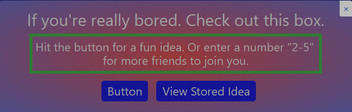

# My-Project-Box

## Usage

This box was created to be included in a group class project.  Is live to show functionality before implementation.

## Problems
On Load fails to load favorite icon from materialize.  Not a call from this application.  Materialize loaded to adjust bored box for project which is using materialize.

## Credits

### [Crystal Ripple 'zMaG33z'](https://github.com/zMag33z)
### [All resources found on Google](https://www.google.com)

## License

### [MIT License Copyright (c) 2022](https://zmag33z.github.io/My-Project-Box/license.md)
